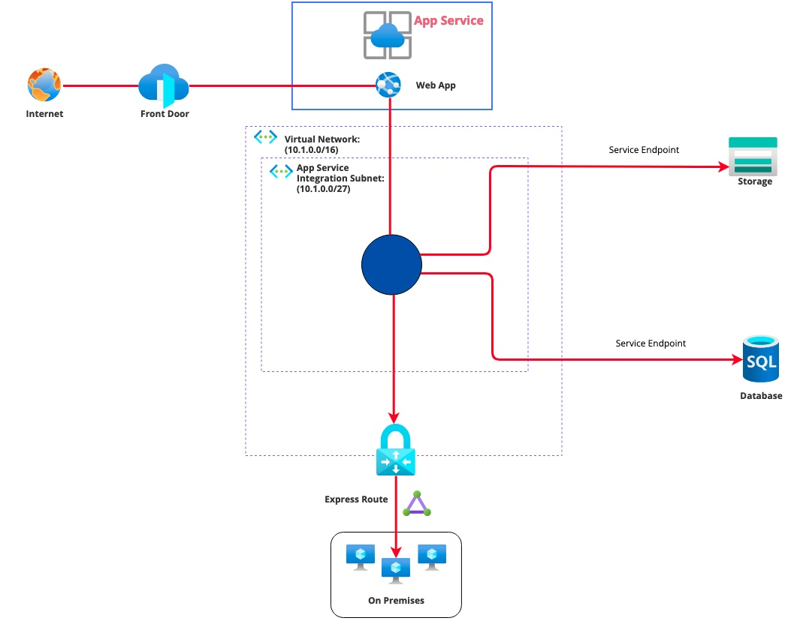
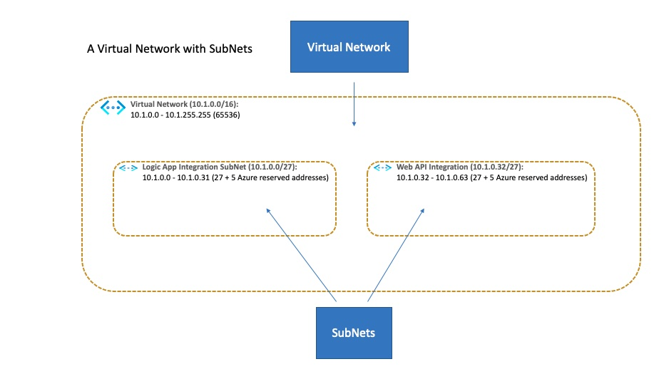

# Designing a Multi-Tenant PaaS Services Environment

Azure PaaS services like Azure App Service, Azure Database Service, etc., offer several advantages compared to deploying and maintaining virtual machines or container orchestration tools like Kubernetes. Patching, redundancy, high availability, and auto-scaling are the primary advantages. Hence, reducing (drastically) the effort spent on operations maintenance. 

**TIP**: *Most PaaS services by vendors like Azure and AWS support common architecture layers - database, web, storage, etc. -  that support technologies like MySQL, NodeJS, Spring Boot, and Blob Storage. There is enough abstraction built in to eliminate vendor lock-in. In contrast, Azure Logic App is an example of an Azure proprietary PaaS service.*

This article introduces design considerations for setting up a secure environment that uses **multi-tenant PaaS services**.

## Deployment Models for PaaS solutions

Azure PaaS services come in two flavors, single-tenant or multi-tenant. 

**Single-tenant PaaS services** deploys within a subscriptions network called a virtual network (VNet). Azure App Service Environment (ASE) and Azure Managed SQL Instance are examples of single-tenant PaaS services. The diagram below shows a single-tenant App Service Environment deployed in a virtual network.

As indicated in the diagram, the ASE is deployed into the VNet because the single-tenant infrastructure for ASE is dedicated to the subscription. We will discuss new terms such as VNet, Subnet, Service Endpoint, and Private Link in the following sections. 

**Multi-tenant PaaS services** exist at Azure’s global network infrastructure and are shared across subscriptions (and hence customers). Azure App Service, Azure SQL Service, Azure Storage Service, Azure Key Vault are examples of multi-tenant PaaS services. The diagram below shows how a multi-tenant App Service is integrated into a subscriptions VNet using Azure's regional VNet integration feature.

## Considerations for using Multi-tenant vs. Single-tenant PaaS services

### Cost and Performance 

Since Azure dedicates infrastructure resources to run single-tenant services, costs are higher with an assurance of better performance. While it is easier to deploy, deploying multiple PaaS services as a single-tenant can quickly evolve into using Azure as a private data center (which is NOT cloud architecture). Hence, consider dedicated single-tenant deployments as an exception.

### Security

- Both deployment models offer robust security (with some exceptions) with methods to isolate the services to a virtual network. 
- Since single-tenant PaaS services are easier to configure as they exist within a VNet. Multi-tenant PaaS services are secured via network routing abstractions called **Service Endpoints** or **Private Links**. We will discuss both these concepts in the following sections.

## Designing a secure environment for Multi-Tenant PaaS services

So, how do we leverage all the benefits of PaaS services and cloud-optimized architectures and still be very secure? Security is all about upfront planning, and it starts with designing an isolation boundary for the resources we set up to interact with each other. This is no different from on-premise design thinking. That is DMZ to Firewall to Secure Network. On Azure, this secure network is called a Virtual Network. 

**TIP**: *If you are tempted to start an Azure project without a VNet, **DONT**.*  

### Virtual Network

A Virtual Network, or VNet, is a logical isolation of subscriptions resources. The VNet is dedicated to a subscription. To provision a VNet, Azure creates a software network abstraction on Azure’s cloud infrastructure. This VNet is private but can be linked to other VNets on Azure and on-premises infrastructure. The VNet follows IP routing principles for connecting resources within the VNet. Hence, the VNet has one or more address spaces (CIDR) associated with it. The address space is further divided into subnets. Subnets reserves address space for a category of resources. For example, you can have an address space reserved for VMs (VM Subnet) that is separate from an address space for a database (Database subnet).     

**TIP**: *If you are associating (via regional VNet integration or deploying single-tenant services) PaaS services within the VNet, allocate enough address space based on the PaaS services requirement. We will cover some of this in the following sections. Defining and designing the subnets is the #1 best practice that will lead to developing a secure application. It is analogous to designing a kitchen cabinet with enough shelves and drawers to store everything in an organized manner.*  

### CIDR

Classless Internet Domain Routing (CIDR) notation is used to represent the IP address space that is reserved for a VNet and SubNet. We represent IP address as a 4 digit notation like 10.0.0.0 where each digit comprises 8 bits with a maximum value of 255. All together, there are 32 bits that make up an address. CIDR represents the address space by stating the starting IP of the address space and showing the number of bits that cannot be changed. For example, 10.0.0.0/32 means that there is exactly one IP (10.0.0.0) in the address space. 10.0.0.0/31 shows that we cannot change the first 31 bits (Hence, leaving 1 bit). So you have an address space of 10.0.0.0-10.0.0.1. For a more in-depth understanding of CIDR notation, please refer to [understanding CIDR notation.](https://devblogs.microsoft.com/premier-developer/understanding-cidr-notation-when-designing-azure-virtual-networks-and-subnets/)  

### SubNet

A SubNet is a reserved sub space in the VNet. Think of it as the shelves and drawers in a cabinet. Each SubNet has its own exclusive address space in the VNet that does not overlap with another SubNet in the same VNet. SubNets provide a facility to organize the VNet into function catogories. For example, you can reseve a SubNet for databases, one for VMs, one for App Services and so on. Alternatively, you can organize the SubNets into functional parts like Integration, Frontend Services, API services, etc. 

**TIP**: *An Azure SubNet reserves 5 addresses for the SubNet's internal functioning. Hence, an example SubNet with 10.1.0.0/32 or 10.1.0.0/31 it will not work. You will need a minimum of 10.1.0.0/30.* 

In the above diagram, the VNet has an address space of 10.1.0.0/16 which is 65536 possible addresses. In this address space there are two SubNets with 32 addresses each. Remember that out of the 32, 5 is reserved by Azure (for the SubNets router/gateway). Hence we will have 27 addesses for our use. The following sections about regional VNet integration will cover how we use these SubNets.

**TIP**: *While new address spaces can be added to a VNet with no problems, SubNets expansions are more delicate. For SubNet address space expansions, ensure that existing resources in the SubNet are moved to another SubNet and then change the address space. In our example, the subnet cushion is deliberately tight (27 addresses) to explain the concepts. For your designs, consider the longer term scalability of your application before allocating an address space for a SubNet.*

## Securing Outgoing Traffic with VNet integration for Multi-Tenant PaaS services

As discussed earlier in the article, Multi-Tenant PaaS services are deployed in Azure’s shared network infrastructure. Hence, they cannot be dedicated to a private VNet. However, Azure provides a service called as regional VNet integration for some of the PaaS services that process incoming and outgoing requests. An example of such a service would be Azure App Service that hosts web applications and API applications. The common pattern for these applications is to accept requests (incoming or ingress) and then invoke (outgoing or egress) another PaaS service like an SQL database.

The diagram above is an example of such a flow. A call from the Internet client reaches Front Door (firewall/proxy service), the request is routed to the API hosted by the App Service, and finally the API calls a database service and a storage service. We can accomplish the entire sequence without a VNet as shown. While there is some protection provided by the routing rules in Front Door, the traffic on the backend is routed using Azures multi-tenant network.

As shown, the API App has requests that are both incoming and outgoing. Azure provides separate services for securing incoming and outgoing traffic. The regional VNet integration isolates the **outgoing** traffic of the PaaS service. When a PaaS service is set up with regional VNet integration, a dedicated subnet in the VNet manages (delegation) the outgoing traffic of the PaaS service. In addition, the integration can also define (called Service Endpoints) the other PaaS services that will be invoked from the integrated service. In our example, we will configure the API App Service to access SQL Database Service and Storage Service via Service Endpoints. 

**TIP**: *It is important to design your PaaS systems with VNet integration in the plans. As you can see in the the digram, the integration  1) Provides the facility to link to other PaaS services via Service Endpoints 2) Allows calls to other resources in the same VNet via IPs 3) Allows call to on premises resources via the virtual network gateway.*

## Securing Incoming Traffic with Private Links or Service Endpoints

As discussed, Regional VNet integration (via deligation) isolates the outgoing traffic from a Multi-Tenant PaaS service. For securing incoming traffic, Azure provides us two methods. 

### Service Endpoint

A Service Endpoint configures a PaaS service to accept (incoming) requests from an allowed VNet. It is automatic network rule enforcement to route and accept only certain requests. While Azure optimizes the path to access the PaaS service defined by the Service Endpoint, the endpoint remains as a publicly routable IP address.

A Service Endpoint comes with a few drawbacks:

1) It exposes a public endpoint and hence exposes a threat vector that is exploitable.

2) It works (only) with regional VNet integration. If a PaaS service does not support regional VNet integration, then Service Endpoint is not an option.

3) Since we configure a Service Endpoint to access the entire service (e.g. all databases that the PaaS service hosts across all subscriptions) and not a specific endpoint (e.g. a single database linked to a subscription), data exfiltration is possible. A threat actor can copy data from an official database linked to an official subscription into the VNet and then copy this data into an unofficial database linked to an unofficial subscription.

### Private Endpoint

To eliminate the issues with Service Endpoints, Azure introduced Private Endpoints and Private Links. A Private Endpoint is an IP that is allocated in the private VNet and is used to route incoming traffic to a PaaS service. A IP that represents the PaaS service in the VNet. With the use of a Private Endpoint, Azure removes access to the PaaS services Public IP. Hence, isolating the (incoming) access to the PaaS service to the VNet.

### Private Link Service

Private Endpoint is mapped to a PaaS service that supports Private Link Service. Any service that is run behind an Azure Standard Load Balancer can be enabled for Private Link access. For a list of Azure PaaS services that support private links, navigate to: https://docs.microsoft.com/en-us/azure/private-link/private-link-service-overview. In addition, custom services can be enabled for Private Link access.

In the above diagarm you can see how Private Endpoints and Private Links eleminates the need for exposing the PaaS services that the application uses publicly. With a combination of VNet, regional VNet integration and Private Endpoints Azure has provided a Mult-Tenant PaaS environment that is isolated and secure. 

## Key Takeaways

1) Consider Azure’s PaaS services for any implementation without the fear of vendor lock in, etc. As explained earlier, in most cases, coding language abstractions built into the PaaS services eliminate lock-in. In addition, PaaS services reduce or eliminate the cost of operational maintenance of the environments. Hence, the focus can be dedicated to innovation and application development.

2) PaaS services provide the same level of security as IaaS. In fact, it can be argued that PaaS services provide better security because Microsoft has invested a lot in developing the PaaS infrastructure. With an IaaS (VMs, AKS) implementation, a lot of security requirements around patching, network isolation, performance, etc. fall back onto the development teams.

3) Begin designing for an environment by planning for the Virtual Network and SubNets. This is analogous to building a house with rooms and bathrooms. If you do not plan for the components, chaos will ensure sooner than later.

4) Use Regional VNet Integration to delegate outgoing traffic to the applications VNet.

5) Use Private End Points and Private Links to isolate the inbound traffic to the PaaS services. Hence, avoid using Service Endpoints as they provide a backdoor for data exfilteration.

Microsoft has spent many hours and resources to develop the PaaS services infrastructure with the goal of simplifying deployments, enhancing security and providing automatic scalability/redundancy options. It is in our best interest to take advantage of these facilities to develop great cloud ready applications.

