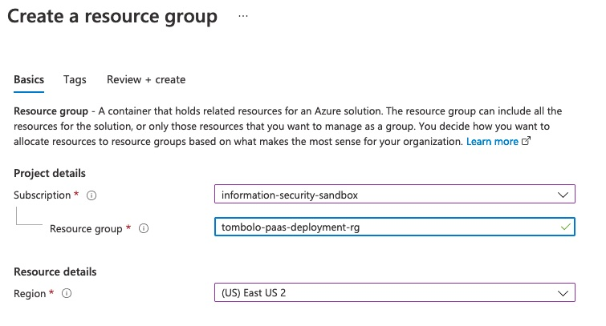
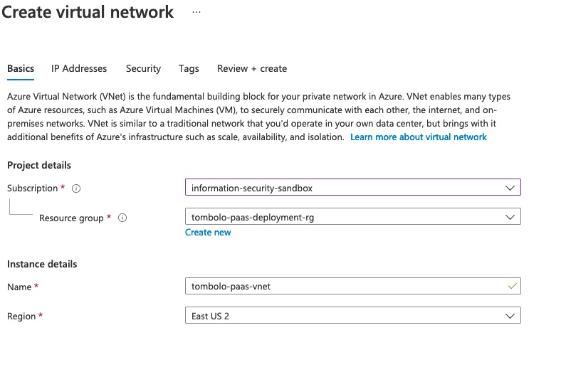
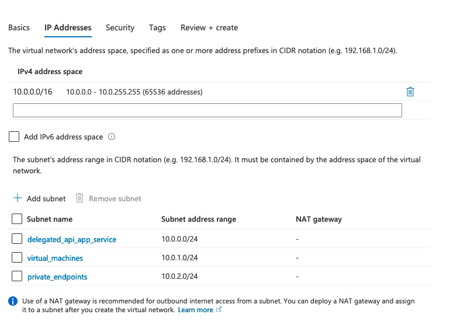

# An Example Azure PaaS Services Environment

["Designing A PaaS Services Environment"](../designing_a_paas_services_environment/README.md) introduced us to the foundation that is required to create an Azure application environment. In this article we will deploy an application that uses multiple Azure services (App Service, Application Gateway, Azure MySQL Service, ...) to demonstrate an optimized environment that is secure and organized for expansion. 

For simplicity, we will name this application **Tombolo**.

## STEP 1: Create a Resource Group

A Resource Group is a logical container that will hold all the resources that we create for the application. 

**TIP**: It is important to select the correct Azure Region where all the resources will be created. That said, when induvidual resources are created, you have the option of selection the region. While using the Portal we have to make sure both regions are the same as a best practice. If you write infrastructure as code (Bicep, Terraform etc.), all resources in the resource group will simply refer to the region of the resource group.    
 
## STEP 2: Virtual Network

For starters, let us create a Virtual Network that is used to secure the resources. In our example, we will use the following parameters:

**Basics**

The key requirements in this screen is to select the resource group that was created in Step 1. Ensure that the same region is selected as in Step 1. 

**IP Addresses**

**Security**
Use the defaults here. For a production configuration enable DDoS and link it to the tenants DDoS protection plan. 

Proceed to review and create
